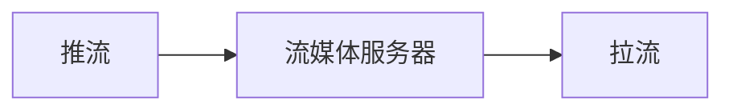

# Web

前端技术是直接沟通`用户`与`产品`的窗口，它的技术诉求是：

- 简单、高效
  
  - 面对复杂的用户群体，开发出满足需求的各种形态的产品；
  
  - 非专业的程序员也可以基于此技术进行创造——有时创意比技术本身更重要；
  
  - 开发简单、高效，同时用户使用起来也足够简单、高效；


    经过简单测试，感觉web入门简单，但想要灵活应用还是有些难度的，需要对 js特性、v8引擎/node.js、浏览器渲染等有一定了解。

    个人关注：视频流处理（MSE）——以此为中心进行扩展学习；

# 0 基础知识

# 1 flask

简单地学习一遍，未深入

参考：[flask的基本使用 - 明-少 - 博客园](https://www.cnblogs.com/xufangming/articles/9330637.html)

## 1.1 基础知识

## 1.2 实践测试

（1）before_request / after_request

- before_request: 对请求的头信息进行处理；

- after_request: 对响应头的信息进行处理；

（2）返回模版

    render_template 是字符串，可以使用make_reponse 增加其它信息；

    `flask.make_response(flask.render_template('index.html'))`

（3）内容解析

- 一般参数： flask.args/values

- 表单: flask.request.form

- 文件：flask.request.file

# 2 三件套回顾：html/csss/Javascript

## 2.1 html

## 2.2 csss

## 2.3 JS

（1）体系结构

- window
  
  - 组件
    
    - document
      
      - element——可嵌套；
      
      - 函数——和window的函数类似；
      
      - style——设置各种css；
    
    - location
    
    - Date...
  
  - 属性
  
  - 函数
    
    - 属性处理
    
    - 事件触发函数 e.g. click
    
    - 事件反应函数 e.g. onclik
  
  > 自定义的变量和函数都属于window的属性和函数；

（2）编程范式

- 基于事件编程： 因为前端处理分成多个步骤，有前后依赖关系，而且不知道什么时候会到来，基于延时的方式比较低效；
  
  - 事件编程更好的实践：promise

- 获取对象
  
  - 事件中通过this 获取当前标签
  
  - 通过 event.target 也可以获取；

## 2.4 Jquery

看了一下,  就是将js 封装出更便捷的API，体感如下：

- 元素的“增删改查”

- 增加了一些元素的动画api；

- 其它

## 2.5 Vue.js

    第一个感觉就是在 html 引入了模版、控制逻辑，将js 与 html 更加无缝衔接在了一起，没有知识鸿沟，后面估计我也不会用；

    第一次见识模版是在flask;

# 3 Nginx 使用

# 4 websockets

浏览器为了安全，仅提供应用层网络协议，即https等；但效率慢、无法双向通信。

websocket 提供一种直接操作TCP/UDP socket 的感觉（其实还是应用层协议）

测试：

- `服务器`向`客户端`发送定时数据；

- `客户端`向`服务器`发送数据片段
  
  - 文件读取和websocket 都需要设置 arraybuffer 进行二进制传输；

# 5 异步处理(CPU)：协程

## 5.1 python

**核心**：建立处理任务里列表，如果存在io耗时任务，则自动切换到其它协程，一种轻量化线程；

**编程范式**：async 协程任务，await 触发协程切换（处理完之后，会返回）；

    - 是并行处理的一种，可以仿照相应的编程范式；

应用：asycio（基础库）, aiohttp

测试：

- 定时发送任务
  
  - get_loop_event()  调用 asyncio.sleep(1) 卡死，所以采用多线程调用；
    
    - 看来应用的特性还需要进一步熟悉？？？
  
  - 调用关系
    
    - aync 函数需要使用await 调用，或者 loop，run 等asyncio 函数；
    
    - await 必须要 aync 函数中
  
  - 

- 流数据传输

## 5.2  http 异步通信(IO)：

**1 promise -  承诺去做**

（1）then - catch 调用方式

    promise.then(func1).catch(func2)

> 也可以嵌套：promise.then().then()

（2）async - await 的调用方式——这点和python 的asyncio 类似

    async 定义函数，await 等待执行；

2 ajax 是异步请求比较成熟的方案，核心

`XMLhttpRequest()`

3 fetch 原生 js ，更简单（目标是代替ajax）

fetch(url, headers)

# 6 MSE meida source

【参考】

- [媒体容器格式（文件类型） - Web 媒体技术 | MDN](https://developer.mozilla.org/zh-CN/docs/Web/Media/Formats/Containers)

- https://www.bilibili.com/video/BV1ZG4y1U7G8/?vd_source=4a2c6fbca09aca06456bc756a53f298e
  
  - 粗略讲了视频文件/编码/流媒体方案/ffmpeg简单入门

- 

## 6.1 基础概念

- 视频
  
  - 封装格式——将视频/音频等文件打包的格式，e.g. mp4/webm/m3u8 等；
  
  - 编码格式——视频的原始图像体积较大，需要进行压缩存储、传输， e.g. 帧间压缩

- 流媒体——像文件流一样，一遍传输，一边播放
  
  - 过去： video.src 是固定的， /path/to/xxx.mp4
  
  - 现在：每段视频文件都放在 meidaSource中，放多少视频，播多少；

- MSE 核心接口介绍
  
  ```js
      const video = document.querySelector("video");
      const assetURL = "video?name=xxx.mp4";
      const mimeCodec = 'video/mp4;codecs="avc1.4D4020, mp4a.40.2"';
  
      function loadVideo() {
          if (MediaSource.isTypeSupported(mimeCodec)) {
              const mediaSource = new MediaSource();
              console.log(mediaSource.readyState); // closed
              video.src = URL.createObjectURL(mediaSource);  // 以此触发 sourceopen
              mediaSource.addEventListener("sourceopen", sourceOpen);
          } else {
              console.error("Unsupported MIME type or codec: ", mimeCodec);
          }
      };
  
      async function sourceOpen() {
          console.log(this.readyState); // open
          const mediaSource = this;
          const sourceBuffer = mediaSource.addSourceBuffer(mimeCodec);
          const response = await fetch(assetURL);
          const buffer = await response.arrayBuffer();
          sourceBuffer.addEventListener("updateend", () => {
              mediaSource.endOfStream();
              video.play();
              console.log(mediaSource.readyState); // ended
          });
          sourceBuffer.appendBuffer(buffer);
      };
  ```

- 踩坑——主要是对相关知识不熟
  
  - video 目前支持的封装/格式？？？
  
  - 视频编码格式有要求，并不是所有的都适用，可以使用如下命令进行转换；
    
    - ```shell
      ffmpeg -i <input file> -c:v libx264 -profile:v main -level 3.2 -pix_fmt yuv420p -b:v <bitrate> -preset medium -tune zerolatency -flags +cgop+low_delay -movflags empty_moov+omit_tfhd_offset+frag_keyframe+default_base_moof+isml -c:a aac <output file.mp4> 
      # 注：-movflags 是关键，其它参数可以不设置
      ```
  
  - 视频 addSourceBuffer 的编码格式也需要设置正确
    
    - 基于 mp4info (bento4 软件包)
    
    - ```
      $ mp4info xxxx.mp4 |grep Codec
          Codec String: avc1.4D4020
          Codec String: mp4a.40.2
      ```

        

## 6.2 参考案例

- [dom-examples/sourcebuffer/script.js at main · mdn/dom-examples · GitHub](https://github.com/mdn/dom-examples/blob/main/sourcebuffer/script.js)
  
  - MSE 最小可运行demo

- [一步一步学习使用 MediaSource 实现动态媒体流-CSDN博客](https://blog.csdn.net/hao_13/article/details/137609377)
  
  - 系统性开发一个视频播放器
  
  - [GitHub - nickdesaulniers/netfix: Let's build a Netflix](https://github.com/nickdesaulniers/netfix)

- https://github.com/Momo707577045/media-source-extract?tab=readme-ov-file
  
  - 网络视频捕获（js注入）

（1）-

（2）系统性开发

- 在进行一些操作时，有些事件需要关闭——需要根据实际情况动态调整`事件的触发`；

- video.ontimeupdate —— 可以作为监控事件

- 通过变量模拟锁——js 执行是单线/进程吗？？？

- 对 video 和 MediaSource 方法的应用有借鉴意义； TODO


（3）通过注入，捕获网络视频

- 修改mediaSource 的相关协议
  
  - window.MediaSource.prototype.endOfStream
    
    - 流结束时提示下载；
  
  - window.MediaSource.prototype.addSourceBuffer
    
    - 增加捕获操作；
  
  - 调用：xxx.call(this, xx)

- 下载方式
  
  - 将数据转换为标签链接，触发下载
    
    - URL.createObjectURL(fileBlob)
  
  - blob 对象的创建；

## 6.2 MP4 格式

# 7 测试

## 7.3 跨域问题

1 问题描述

    如果可以跨域，js可以 肆意的获取非本域链接（利用本地cookie），操作一些数据，跨域攻击；

[通过fetch看跨域：是谁阻止了跨域请求？ - 掘金](https://juejin.cn/post/7064127816404566053)

[前端安全系列（二）：如何防止CSRF攻击？ - 美团技术团队](https://tech.meituan.com/2018/10/11/fe-security-csrf.html)

2 解决方案

（1）CORS: 跨域请求网站的头文件增加如下，表示允许跨域

    `resp.headers['Access-Control-Allow-Origin'] = '*'`

> flask 提供了 flask_cors 直接支持；

**（2）Jsonp:**

- 利用标签内src 可以跨域访问的特性，在<script> 中增加跨域链接；

- 目标域服务器，将 `callback` 和 `data` 一起返还给当前 <script>

- 当前<script>会将 callback(data) 组合城一个可执行的命令；实现我们想要的操作；
  
  - 这应是script 特性，不再深入；

```
<!DOCTYPE html>
<html lang="en">
<head>
    <meta charset="UTF-8">
    <title>index.html</title>
</head>
<body>
    <script>
    function jsonpCallback(data) {
        alert('获得 X 数据:' + data);
    }
    </script>
    <script src="http://127.0.0.1:3000/cors?callback=jsonpCallback"></script>
</body>
</html>
```

```python
import json
import sys
import flask
from flask import Flask, jsonify, request, render_template
app = Flask(__name__)

 # 目标域服务器 127.0.0.1:3000
@app.route('/cors', methods=['GET'])
def hello_world():
    print(f" - log {5000}", request.headers)
    callback = request.args.get('callback')
    result = json.dumps({"a":1})
    response = f"{callback}({result})"

    return response, 200, {'Content-Type': 'application/javascript'}

# 本地域服务器 127.0.0.1:3000
@app.route('/', methods=['GET'])
def index():
    return render_template('index.html')


if __name__ == '__main__':
    # app.run(host='0.0.0.0', port=5000, debug=True)
    if len(sys.argv) != 2:
        print(f' should set poort for different server')
    app.run(port=int(sys.argv[1]))
```

 （3）代理请求

        当本域服务器作为代理服务， 后段请求跨域链接；

## 7.4 文件上传问题

**(1) js 运行问题**

 [Uncaught TypeError: Cannot set property 'onclick' of null [duplicate]](https://stackoverflow.com/questions/9778888/uncaught-typeerror-cannot-set-property-onclick-of-null)

原因：js 应该在html 加载之后执行，否则无法获取相应的element;

```js
window.onload = function(){ 
    // your code 
};
```

**（2）form 提交问题**

- form 提交会会关闭当前页面，并打开一个新的页面，可以由form action 进行控制；
  
  - 表现为：对当前页面的刷新；
  
  - 可以通过将form 请求注入到 iframe 进行处理；
    
    - （注：`form.target === iframe.name`）设置错误导致，导致 `window.open is blocked` 问题
    
    - target 表示以何种方式打开新的页面；

- 刷新/回退等会触发表单的重复提交（如果你身处在form 新打开的窗口的画）
  
  - 需要及时关闭 form 打开的窗口；
  
  - 或者web 前/后端利用缓存技术进行判断（e.g. cookie）

**（3）flask 文件读取**

- 文件和form 表单是分别获取的，通过 flask.request.form 获取表单，通过flask.request.files 来获取文件（文件对象为`werkzeug.datastructures.file_storage.FileStorage`）

# 8 流媒体解决方案



- 推流
  
  - 直播：实时监控——单独购摄像头，数据为rtsp 格式

- 流媒体服务器
  
  - 数据中转/分发
  
  - 转码等

- 拉流
  
  - dash
    
    - hls——>hls.js
  
  - http-flv——> flv.js/mept.js
  
  > 前端的js库，作用是将自定义的封装，转换为video可接受的封装（mp4/webm）;

【参考】

- [Lewin's Blog](https://lewinblog.com/blog/page/2022/221210-flv-js.md#%E5%AE%8F%E8%A7%82%E7%BB%93%E6%9E%84)
  
  - 介绍了flv.js 源码
